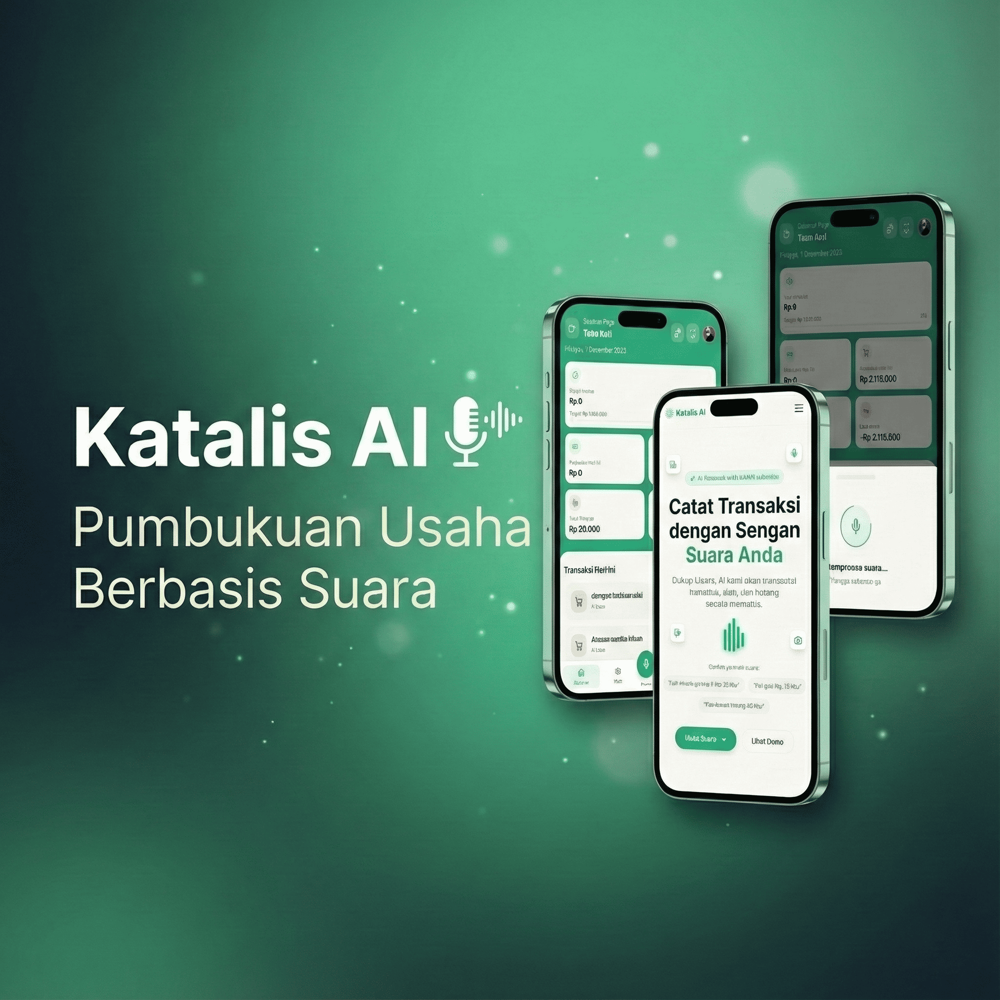
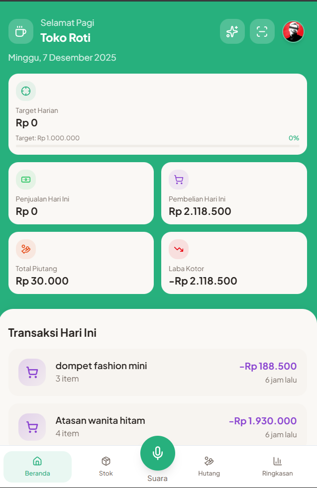
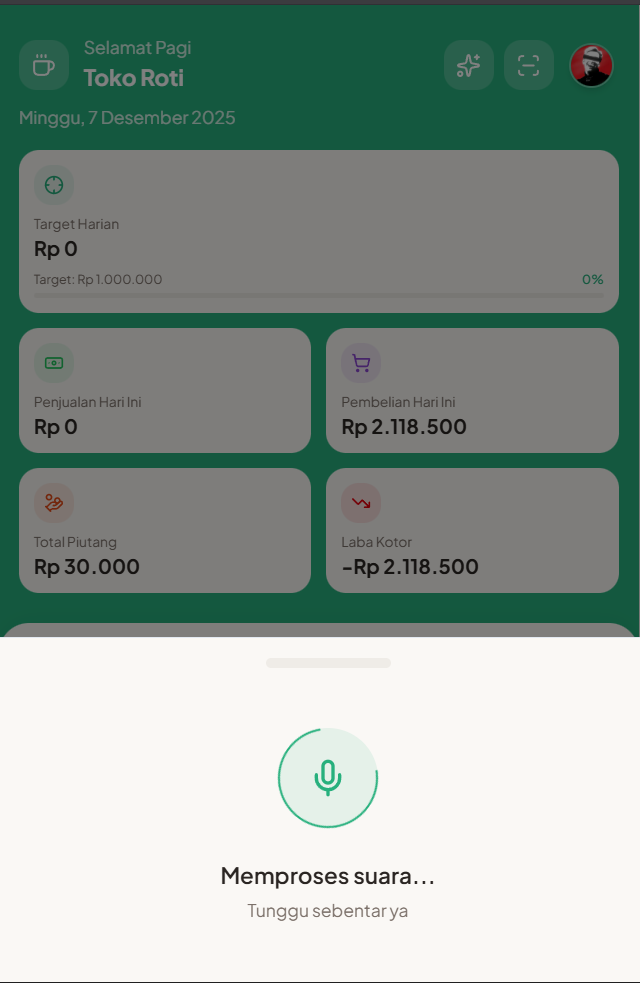
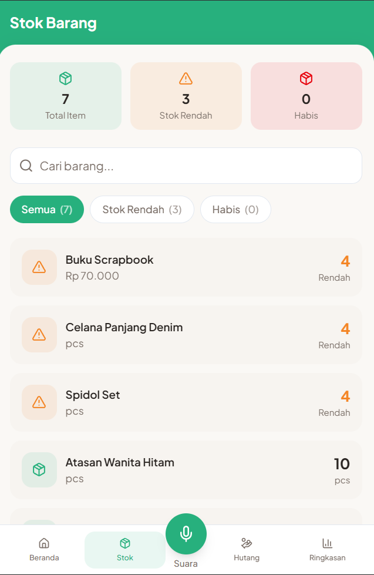
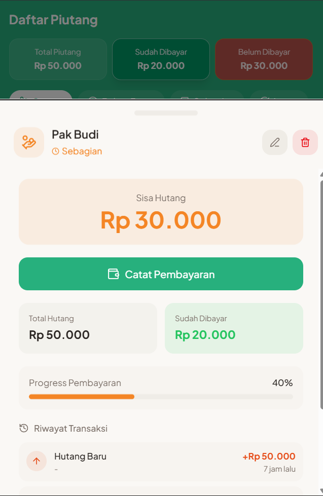
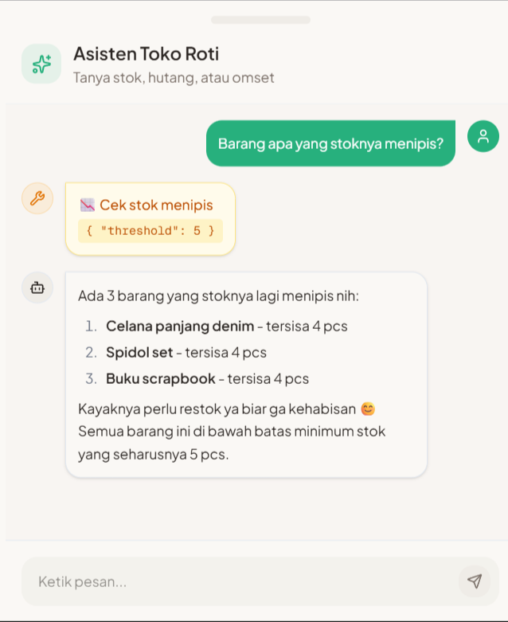

# 🎙️ Katalis AI - Pembukuan Usaha Berbasis Suara

<p align="center">
  
</p>

<p align="center">
  <strong>Voice-First AI Assistant untuk UMKM Indonesia</strong><br/>
  Catat transaksi, kelola stok, dan pantau hutang hanya dengan suara Anda.
</p>

<p align="center">
  <a href="#-fitur-utama">Fitur</a> •
  <a href="#-demo">Demo</a> •
  <a href="#-instalasi">Instalasi</a> •
  <a href="#-cara-penggunaan">Penggunaan</a> •
  <a href="#️-tech-stack">Tech Stack</a>
</p>

---

## 🎯 Masalah yang Diselesaikan

Bayangkan seorang **pedagang sayur di pasar tradisional**:

> 🥬 Tangan penuh lumpur dan basah dari menimbang sayuran  
> 📱 Mustahil mengetik panjang-panjang di HP untuk input transaksi  
> 💸 Pelanggan antri ramai, tidak sempat catat siapa yang hutang  
> 📝 Akhirnya lupa berapa yang sudah terjual hari ini  

**Masalah nyata pelaku UMKM Indonesia:**
- ❌ **Repot mengetik** - harus ketik nama barang, jumlah, harga satu-satu
- ❌ **Sibuk melayani pelanggan** - tidak sempat input manual
- ❌ **Tidak terbiasa** dengan aplikasi pembukuan yang rumit
- ❌ **Lupa mencatat** hutang pelanggan
- ❌ **Bingung menghitung** stok dan modal di akhir hari

### 💡 Solusi: Tap Sekali, Ngomong, Selesai!

**Katalis AI** hadir dengan pendekatan **Voice-First** - pedagang cukup **tap 1x tombol, bicara, tap konfirmasi**. Tidak perlu mengetik panjang!

| Cara Lama (Ketik Manual) | Cara Baru (Katalis AI) |
|--------------------------|------------------------|
| Input barang → Isi jumlah → Isi harga → Simpan → *(ulangi per item)* | **Tap 🎤 → Bicara → Tap ✓** |

AI akan otomatis mencatat semuanya! ✨

---

## ✨ Fitur Utama

### 🎤 Voice-to-Transaction
Catat transaksi dengan perintah suara natural dalam Bahasa Indonesia:
- *"Jual minyak goreng 2 liter, 32 ribu"*
- *"Beli Indomie 1 dus 110 ribu isinya 40 bungkus"*
- *"Bu Tejo ngutang 50 ribu"*
- *"Pak Ahmad bayar hutang 25 ribu"*

### 📊 Dashboard Real-time
- Penjualan & pembelian hari ini
- Laba kotor otomatis terhitung
- Target penjualan (harian/mingguan/bulanan)
- Transaksi terkini

### 📦 Manajemen Stok
- Track quantity dalam satuan pack (dus) dan eceran (pcs)
- Harga modal & harga jual
- Notifikasi stok menipis
- Riwayat pergerakan stok

### 💳 Manajemen Hutang/Piutang
- Catat hutang pelanggan dengan suara
- Riwayat pembayaran cicilan
- Status: Pending, Partial, Lunas
- Detail per pelanggan

### 📸 OCR Scanner
- Scan nota belanja dari kamera atau galeri
- Auto-extract item, quantity, dan harga
- Langsung tambah ke stok

### 🤖 AI Agent Chat
- Tanya jawab dengan asisten AI
- *"Berapa total penjualan hari ini?"*
- *"Siapa yang punya hutang paling besar?"*
- *"Stok apa yang hampir habis?"*

---

## 🎥 Demo

> **Video Demo:** [Link ke video demo](https://drive.google.com/file/d/1AUqVo_Q4PyD7bWOmZyDs6RfKntp1ck-F/view?usp=sharing)

### Screenshots

| Dashboard | Voice Input | Stok |
|:---------:|:-----------:|:----:|
|  |  |  |

| Hutang | OCR Scan | AI Agent |
|:------:|:--------:|:--------:|
|  |  |  |

---

## 🚀 Instalasi

### Prerequisites
- Node.js 18+ 
- pnpm (recommended) atau npm
- Akun OpenAI (untuk Whisper & GPT)
- Akun Firebase (untuk Auth & Firestore)
- Akun Kolosal AI (untuk OCR) - opsional
- Akun UploadThing (untuk upload foto profil)

### Setup

1. **Clone repository**
   ```bash
   git clone https://github.com/your-username/katalis-ai.git
   cd katalis-ai
   ```

2. **Install dependencies**
   ```bash
   pnpm install
   # atau
   npm install
   ```

3. **Setup environment variables**
   ```bash
   cp .env.example .env.local
   ```
   Isi semua variabel di `.env.local` (lihat bagian [Environment Variables](#-environment-variables))

4. **Jalankan development server**
   ```bash
   pnpm dev
   # atau
   npm run dev
   ```

5. **Buka di browser**
   ```
   http://localhost:3000
   ```

---

## 🔐 Environment Variables

Buat file `.env.local` dengan isi:

```env
# OpenAI - untuk Speech-to-Text & NLP
OPENAI_API_KEY=sk-xxxxxxxxxxxxxxxxxxxxxxxx

# Kolosal AI - untuk OCR (opsional, bisa pakai OpenAI)
KOLOSAL_API_KEY=your-kolosal-api-key

# Firebase Configuration
NEXT_PUBLIC_FIREBASE_API_KEY=AIzaxxxxxxxxxxxxxxxxxx
NEXT_PUBLIC_FIREBASE_AUTH_DOMAIN=your-project.firebaseapp.com
NEXT_PUBLIC_FIREBASE_PROJECT_ID=your-project-id
NEXT_PUBLIC_FIREBASE_STORAGE_BUCKET=your-project.appspot.com
NEXT_PUBLIC_FIREBASE_MESSAGING_SENDER_ID=123456789
NEXT_PUBLIC_FIREBASE_APP_ID=1:123456789:web:abcdef
NEXT_PUBLIC_FIREBASE_MEASUREMENT_ID=G-XXXXXXXXXX

# UploadThing - untuk upload foto profil (opsional)
UPLOADTHING_TOKEN=your-uploadthing-token
UPLOADTHING_SECRET=your-uploadthing-secret
```

### Cara Mendapatkan API Keys:

| Service | Link | Catatan |
|---------|------|---------|
| OpenAI | [platform.openai.com](https://platform.openai.com/api-keys) | Diperlukan untuk voice & NLP |
| Firebase | [console.firebase.google.com](https://console.firebase.google.com) | Buat project baru, enable Auth & Firestore |
| Kolosal AI | [kolosal.ai](https://kolosal.ai) | Opsional untuk OCR |
| UploadThing | [uploadthing.com](https://uploadthing.com) | Opsional untuk foto profil |

---

## 📖 Cara Penggunaan

### 1. Login/Register
- Buka aplikasi dan klik "Mulai Gratis"
- Login dengan Google atau email

### 2. Recording Transaksi dengan Suara
1. Tekan tombol **mikrofon** di bottom navigation
2. **Tahan dan bicara** atau **tap sekali** untuk mulai recording
3. Ucapkan transaksi dalam bahasa natural, contoh:
   - Penjualan: *"Jual telur 2 kilo, 64 ribu"*
   - Pembelian: *"Beli beras 25 kg harga 350 ribu"*
   - Hutang: *"Bu Siti ngutang 30 ribu"*
   - Bayar hutang: *"Pak Budi bayar 50 ribu"*
4. **Lepas** atau **tap lagi** untuk stop
5. Konfirmasi hasil parsing AI

### 3. Scan Nota dengan OCR
1. Klik icon **kamera** di header
2. Ambil foto nota atau pilih dari galeri
3. AI akan extract semua item
4. Pilih untuk simpan sebagai transaksi atau tambah ke stok

### 4. Chat dengan AI Agent
1. Klik icon **robot** di header
2. Ketik atau gunakan template pertanyaan:
   - *"Rangkum penjualan hari ini"*
   - *"Tampilkan semua hutang"*
   - *"Stok apa yang hampir habis?"*

---

## 🛠️ Tech Stack

| Category | Technology |
|----------|------------|
| **Framework** | Next.js 16 (App Router) |
| **Language** | TypeScript |
| **Styling** | TailwindCSS v4 |
| **UI Components** | shadcn/ui + Radix UI |
| **State Management** | Zustand |
| **Database** | Firebase Firestore |
| **Authentication** | Firebase Auth |
| **AI/ML** | OpenAI Whisper (STT), GPT-4o-mini (NLP), Kolosal AI (OCR), Kolosal Claude Sonnet 4.5 (Agent) |
| **File Upload** | UploadThing |
| **Charts** | Recharts |

---

## 📁 Struktur Project

```
katalis-ai/
├── app/                    # Next.js App Router
│   ├── (dashboard)/        # Dashboard pages (protected)
│   ├── api/                # API routes (voice, ocr, agent)
│   └── page.tsx            # Landing page
├── components/             # React components
│   ├── ui/                 # Base UI components (shadcn)
│   ├── landing/            # Landing page sections
│   └── ...                 # Feature components
├── context/                # React contexts (Auth, Voice)
├── hooks/                  # Custom React hooks
├── lib/                    # Utilities & services
│   ├── aiService.ts        # OpenAI integration
│   ├── ocrService.ts       # OCR processing
│   ├── firebase.ts         # Firebase config
│   └── firestoreService.ts # Firestore sync
├── store/                  # Zustand stores
│   ├── useTransactionStore.ts
│   ├── useStockStore.ts
│   └── ...
├── types/                  # TypeScript definitions
└── public/                 # Static assets
```

---

## 👥 Tim

| Nama | Role |
|------|------|
| M. Galih Pratama Putra | Developer |
| Salman Lukman | Developer |
| Petra Lovian Hutajulu | Developer |
| Rezki Prayoga | Developer |
| Ardhan Hisyam Arrafi | Developer |

---

## 📄 Lisensi

MIT License - Silakan gunakan dan modifikasi sesuai kebutuhan.

[](LICENSE)

---

<p align="center">
  Dibuat dengan ❤️ untuk UMKM Indonesia
</p>
